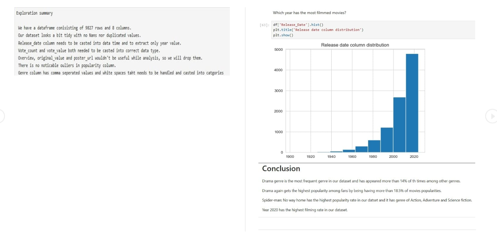

# Netflix Viewing Trends Analysis (Python)

## 📚 Table of Contents
- [Objective](#-objective)
- [Project Structure](#-project-structure)
- [Tools & Libraries Used](#-tools--libraries-used)
- [Key Insights](#-key-insights)
- [What I Learned](#-what-i-learned)
- [Screenshots](#-screenshots)
- [Conclusion](#-conclusion)
- [Source](#-source)
- [Author](#-author)

## 🎯 Objective
Analyze Netflix content data to uncover trends in content types, popular genres, top-producing countries, and most popular titles using Python.

## 📁 Project Structure
- notebook/ – Contains the Jupyter Notebook for analysis and visualizations
- data/ – Contains the dataset (netflix_titles.csv)
- screenshots/ – (Optional) Visuals/graphs from the project

## 🛠 Tools & Libraries Used
- Python (Pandas, Matplotlib, Seaborn)
- Jupyter Notebook / Anaconda
- Dataset Source: YouTube tutorial (based on Netflix dataset)

## 📊 Key Insights
- 🎭 *Drama* is the most frequent and popular genre, appearing in over *14%* of titles and generating *18.5%* of popularity.
- 🕷 *Spider-Man: No Way Home* is the most popular movie in the dataset (genre: Action, Adventure, Sci-Fi).
- 📅 *2020* had the highest number of films released.

## 💡 What I Learned
- Cleaned and analyzed real-world data using pandas
- Built meaningful charts with matplotlib and seaborn
- Structured an analysis for presentation in a professional GitHub format

## 📸 Screenshots

## ✅ Conclusion
This project helped me apply core data analysis skills to entertainment data and present insights visually. It enhanced my storytelling ability using Python and built confidence in working with real datasets.

## 📺 Source
Project inspired by [this YouTube tutorial](https://youtu.be/tjIWRqqMDaw?si=R4JPE256HrCnFocV)

## 👩‍💻 Author
*Kirti* – Aspiring Data Analyst  
[GitHub Profile](https://github.com/Kirti-DA)
